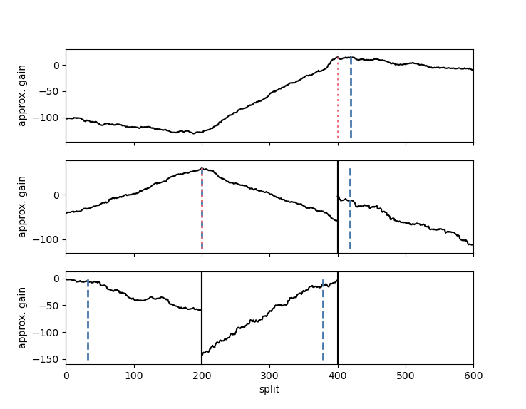

# Random Forests for Change Point Detection

Change point detection aims to identify structural breaks in the probability
distribution of a time series. Existing methods either assume a parametric model for
within-segment distributions or are based on ranks or distances and thus fail in
scenarios with a reasonably large dimensionality.

`changeforest` implements a classifier-based algorithm that consistently estimates
change points without any parametric assumptions, even in high-dimensional scenarios.
It uses the out-of-bag probability predictions of a random forest to construct a
classifier log-likelihood ratio that gets optimized using a computationally feasible two-step
method.

See [1] for details.

## Installation

To install from `conda-forge` (recommended), run
```bash
conda install -c conda-forge changeforest
```

To install from `PyPI`, run
```bash
pip install changeforest
```

## Example

In the following example, we perform random forest-based change point detection on
a simulated dataset with `n=600` observations and covariance shifts at `t=200, 400`.

```python
In [1]: import numpy as np
   ...: 
   ...: Sigma = np.full((5, 5), 0.7)
   ...: np.fill_diagonal(Sigma, 1)
   ...: 
   ...: rng = np.random.default_rng(12)
   ...: X = np.concatenate(
   ...:     (
   ...:         rng.normal(0, 1, (200, 5)),
   ...:         rng.multivariate_normal(np.zeros(5), Sigma, 200, method="cholesky"),
   ...:         rng.normal(0, 1, (200, 5)),
   ...:     ),
   ...:     axis=0,
   ...: )
```

The simulated dataset `X` coincides with the _change in covariance_ (CIC) setup
described in [1]. Observations in the first and last segments are independently drawn
from a standard multivariate Gaussian distribution. Observations in the second segment
are i.i.d. normal with mean zero and unit variance, but with a covariance of ρ = 0.7
between coordinates. This is a challenging scenario.

```python
In [2]: from changeforest import changeforest
   ...: 
   ...: result = changeforest(X, "random_forest", "bs")
   ...: result
Out[2]: 
                    best_split max_gain p_value
(0, 600]                   400   14.814   0.005
 ¦--(0, 400]               200   59.314   0.005
 ¦   ¦--(0, 200]             6    -1.95    0.67
 ¦   °--(200, 400]         393   -8.668    0.81
 °--(400, 600]             412   -9.047    0.66

In [3]: result.split_points()
Out[3]: [200, 400]
```

`changeforest` correctly identifies the change points at `t=200` and `t=400`. The
`changeforest` function returns a `BinarySegmentationResult`. We use its `plot` method
to investigate the gain curves maximized by the change point estimates:

```python
In [4]: result.plot().show()
```
<p align="center">
  
</p>
Change point estimates are marked in red.

For `method="random_forest"` and `method="knn"`, the `changeforest` algorithm uses a two-step approach to
find an optimizer of the gain. This fits a classifier for three split candidates
at the segment's 1/4, 1/2 and 3/4 quantiles, computes approximate gain curves using
the resulting classifier log-likelihood ratios and selects the overall optimizer as a second guess.
We can investigate the gain curves from the optimizer using the `plot` method of `OptimizerResult`.
The initial guesses are marked in blue.

```python
In [5]: result.optimizer_result.plot().show()
```
<p align="center">
  
</p>
 
One can observe that the approximate gain curves are piecewise linear, with maxima
around the true underlying change points.

The `BinarySegmentationResult` returned by `changeforest` is a tree-like object with attributes
`start`, `stop`, `best_split`, `max_gain`, `p_value`, `is_significant`, `optimizer_result`, `model_selection_result`, `left`, `right` and `segments`. 
These can be interesting to investigate the output of the algorithm further.

The `changeforest` algorithm can be tuned with hyperparameters. See
[here](https://github.com/mlondschien/changeforest/blob/287ac0f10728518d6a00bf698a4d5834ae98715d/src/control.rs#L3-L30)
for their descriptions and default values. In Python, the parameters can
be specified with the [`Control` class](https://github.com/mlondschien/changeforest/blob/b33533fe0ddf64c1ea60d0d2203e55b117811667/changeforest-py/changeforest/control.py#L1-L26),
which can be passed to `changeforest`. The following will build random forests with
50 trees:

```python
In [6]: from changeforest import Control
   ...: changeforest(X, "random_forest", "bs", Control(random_forest_n_estimators=50))
Out[6]: 
                    best_split max_gain p_value
(0, 600]                   416    7.463    0.01
 ¦--(0, 416]               200   43.935   0.005
 ¦   ¦--(0, 200]           193  -14.993   0.945
 ¦   °--(200, 416]         217    -9.13   0.085
 °--(416, 600]             591   -12.07       1 
```

The `changeforest` algorithm still detects change points at `t=200`, but is slightly off
with `t=416`.

Due to the nature of the change, `method="change_in_mean"` is unable to detect any
change points at all:
```python
In [7]: changeforest(X, "change_in_mean", "bs")
Out[7]: 
          best_split max_gain p_value
(0, 600]         589    8.625  
```

## References

[1] M. Londschien, P. Bühlmann and S. Kovács (2023). "Random Forests for Change Point Detection" Journal of Machine Learning Research
