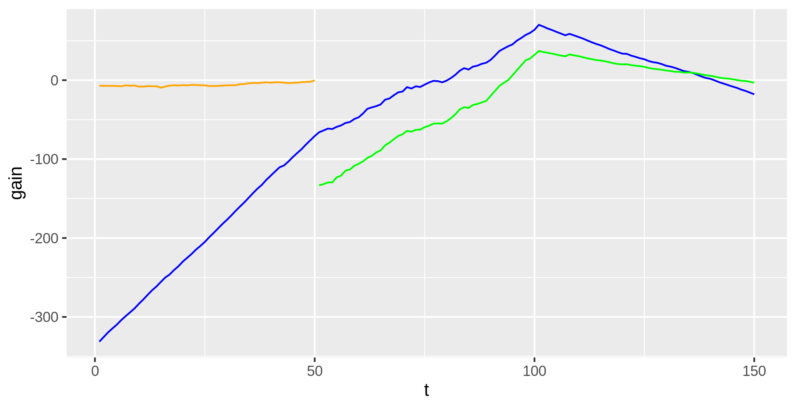

# Classifier based non-parametric change point detection

Change point detection tries to identify times when the probability distribution of a
stochastic process or time series changes. Existing methods either assume a parametric
model for within-segment distributions or a based on ranks or distances, and thus fail
in scenarios with reasonably large dimensionality.

`changeforest` implements a classifier based algorithm that consistently estimates
change points without any parametric assumptions even in high-dimensional scenarios.
See [1] for details.

## Installation

To install from `conda-forge` (currently linux and MacOs only), simply run
```bash
conda install -c conda-forge r-changeforest
```
Note that `r-changeforest` is currently available for linux and MacOs only.

## Example

The following example performs random forest based change point detection on the iris
dataset. This includes three classes _setosa_, _versicolor_ and _virginica_ with 50
observations each. We interpret this as a simulated time series with change points at
`t = 50, 100`.

```R
> library(changeforest)
> library(datasets)
> data(iris)
> X <- as.matrix(iris[, 1:4])
> changeforest(X, "random_forest", "bs")
                name best_split  max_gain p_value is_significant
1 (0, 150]                   50 96.173664    0.01           TRUE
2  ¦--(0, 50]                34 -5.262184    1.00          FALSE
3  °--(50, 150]             100 51.557473    0.01           TRUE
4      ¦--(50, 100]          80 -3.068934    1.00          FALSE
5      °--(100, 150]        134 -2.063508    1.00          FALSE
```

`changeforest` also implements methods `change_in_mean` and `knn`. While `random_forest`
and `knn` implement the `TwoStepSearch` optimizer as described in [1], for
`change_in_mean` the optimizer `GridSearch` is used. Both `random_forest` and `knn`
perform model selection via a pseudo-permutation test (see [1]). For `change_in_mean`
split candidates are kept whenever `max_gain > control.minimal_gain_to_split`.

The iris dataset allows for rather simple classification due to large mean shifts between classes. As a
result, both `change_in_mean` and `knn` also correctly identify die true change points.

```R
> result <- changeforest(X, "change_in_mean", "bs")
> result$split_points()
[1] [50, 100]
> result <- changeforest(X, "knn", "bs")
> result$split_points()
[1] [50, 100]
```

`changeforest` returns a tree-like object with attributes `start`, `stop`, `best_split`, `max_gain`, `p_value`, `is_significant`, `optimizer_result`, `model_selection_result`, `left`, `right` and `segments`. These can be interesting to further investigate the output of the algorithm. Here we
plot the approximated gain curves of the first three segments:
```R
> library(ggplot2)
> result <- changeforest(X, "random_forest", "bs")
> data = data.frame(
        t=1:150,
        gain=result$optimizer_result$gain_results[[3]]$gain,
        gain_left=c(result$left$optimizer_result$gain_results[[3]]$gain, rep(NA, 100)),
        gain_right=c(rep(NA, 50), result$right$optimizer_result$gain_results[[3]]$gain)
)

> ggplot(data=data) +
        geom_line(aes(x=t, y=gain), color="blue") + 
        geom_line(aes(x=t, y=gain_left), color="orange") + 
        geom_line(aes(x=t, y=gain_right), color="green")
```

<p align="center">
  
</p>

One can clearly observe that the approx. gain curves are piecewise linear, with maxima
at the true underlying change points.

The `changeforest` algorithm can be tuned with hyperparameters. See [here](https://github.com/mlondschien/changeforest/blob/b33533fe0ddf64c1ea60d0d2203e55b117811667/src/control.rs#L3-L39) for their descriptions and default values. In R, the parameters can
be specified with the [`Control` class](https://github.com/mlondschien/changeforest/blob/main/changeforest-r/R/control.R)
 which can be passed to `changeforest`. The following
will build random forests with very few trees:

```R
> changeforest(X, "random_forest", "bs", Control(random_forest_ntrees=10))
... TODO
```

## References

[1] M. Londschien, S. Kovács and P. Bühlmann (2021), "Random Forests and other nonparametric classifiers for multivariate change point detection", working paper.
