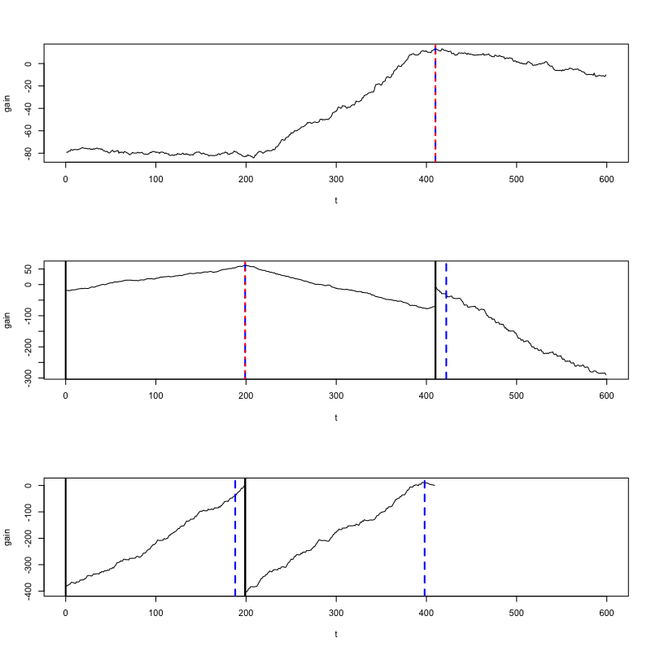

# Classifier based non-parametric change point detection

Change point detection tries to identify times when the probability distribution of a
stochastic process or time series changes. Existing methods either assume a parametric
model for within-segment distributions or are based on ranks or distances and thus fail
in scenarios with a reasonably large dimensionality.

`changeforest` implements a classifier based algorithm that consistently estimates
change points without any parametric assumptions, even in high-dimensional scenarios.
See [1] for details.

To install from `conda-forge`, run

```bash
conda install -c conda-forge r-changeforest
```

See [here](https://github.com/conda-forge/miniforge) for instructions on how to install `conda`.

## Example

In the following example, we perform random forest-based change point detection on
a simulated dataset with `n=600` observations and covariance shifts at `t=200, 400`.

```R
> library(MASS)

> set.seed(0)
> Sigma = matrix(0.7, nrow=5, ncol=5)
> diag(Sigma) = 1
> mu = rep(0, 5)
> X = rbind(
    mvrnorm(n=200, mu=mu, Sigma=diag(5)),
    mvrnorm(n=200, mu=mu, Sigma=Sigma),
    mvrnorm(n=200, mu=mu, Sigma=diag(5))
)
```

The simulated dataset `X` coincides with the _change in covariance_ (CIC) setup
described in [1]. Observations in the first and last segment are independently drawn
from a standard multivariate Gaussian distribution. Observations in the second segment
are i.i.d. normal with mean zero and unit variance, but with a covariance of ρ = 0.7
between coordinates. This is a challenging scenario.


```R
> library(changeforest)

> result = changeforest(X, "random_forest", "bs")
> result
                 name best_split  max_gain p_value is_significant
1 (0, 600]                   410  13.49775   0.005           TRUE
2  ¦--(0, 410]               199  61.47201   0.005           TRUE
3  ¦    ¦--(0, 199]          192 -22.47364   0.955          FALSE
4  ¦    °--(199, 410]        396  11.50559   0.190          FALSE
5  °--(410, 600]             416 -23.52932   0.965          FALSE

> result$split_points()
[1] 199 410
```

`changeforest` correctly identifies the change point around `t=200` but is slightly
off at `t=410`. The `changeforest` function returns an object of class `binary_segmentation_result`.
We use its `plot` method to investigate the gain curves maximized by the change point estimates:

```
> plot(result)
```
<p align="center">
  
</p>

Change point estimates are marked in red.

For `method="random_forest"` (and `method="knn"`), the `changeforest` algorithm uses a two-step approach to
find an optimizer of the gain. This fits a classifier for three split candidates
at the segment's 1/4, 1/2 and 3/4 quantiles  computes approximate gain curves using
the resulting pseudo-log-likelihoods and selects the overall optimizer as a second guess.
We can investigate the gain curves from the optimizer using the `plot` method of `optimizer_result`.
The initial guesses are marked in blue.

```
result.optimizer_result.plot().show()
```
<p align="center">
  
</p>
 
One can observe that the approximate gain curves are piecewise linear, with maxima
at the true underlying change points.

The `binary_segmentation_result` object returned by `changeforest` is a tree-like object with attributes
`start`, `stop`, `best_split`, `max_gain`, `p_value`, `is_significant`, `optimizer_result`, `model_selection_result`, `left`, `right` and `segments`. 
These can be interesting to investigate the output of the algorithm further.

The `changeforest` algorithm can be tuned with hyperparameters. See
[here](https://github.com/mlondschien/changeforest/blob/287ac0f10728518d6a00bf698a4d5834ae98715d/src/control.rs#L3-L30)
for their descriptions and default values. In R, the parameters can
be specified with the `Control` class,
which can be passed to `changeforest`. The following will build random forests with
20 trees:

```R
> changeforest(X, "random_forest", "bs", Control$new(random_forest_n_estimators=20))
                         name best_split   max_gain p_value is_significant
1 (0, 600]                            15  -6.592136   0.010           TRUE
2  ¦--(0, 15]                          6 -18.186534   0.935          FALSE
3  °--(15, 600]                      561  -4.282799   0.005           TRUE
4      ¦--(15, 561]                  116  -8.084126   0.005           TRUE
5      ¦    ¦--(15, 116]              21 -17.780523   0.130          FALSE
6      ¦    °--(116, 561]            401  11.782002   0.005           TRUE
7      ¦        ¦--(116, 401]        196  22.792401   0.150          FALSE
8      ¦        °--(401, 561]        554 -16.338703   0.800          FALSE
9      °--(561, 600]                 568  -5.230075   0.120          FALSE    
```

The `changeforest` algorithm still detects the change point around `t=200` but also
returns false positives.

Due to the nature of the change, `method="change_in_mean"` is unable to detect any
change points at all:
```R
> changeforest(X, "change_in_mean", "bs")
      name best_split max_gain p_value is_significant
1 (0, 600]        498 17.29389      NA          FALSE
```


## References

[1] M. Londschien, S. Kovács and P. Bühlmann (2022), "Random Forests for Change Point Detection", working paper.
